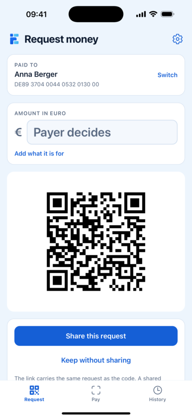
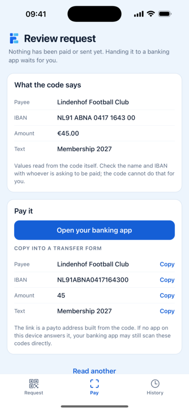
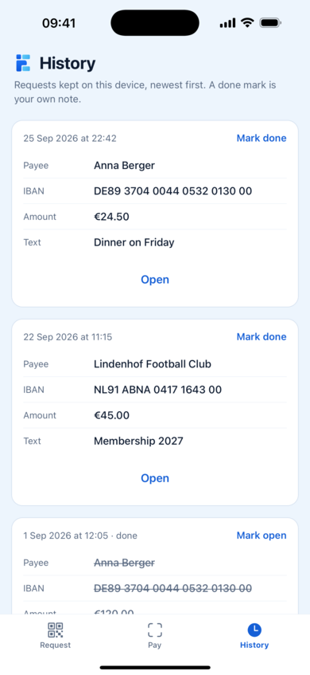

<p align="center"></p>

<h1 align="center">Euvena</h1>

<p align="center"><strong>Open-source building blocks for instant payments in Europe.</strong></p>

<p align="center">EPC QR · EN 18184 · payto · SEPA · TypeScript · React Native</p>

<p align="center">
  
  
  
</p>

Europe has world-class payment rails: since October 2025 every eurozone bank must send and
receive SEPA Instant Credit Transfers 24/7 in under 10 seconds, at no premium over a regular
transfer. The standards on top of the rails are open too: QR codes, payee verification,
request-to-pay. What is missing is open-source software that implements them.

Euvena fills that gap: a set of independently usable, Apache-2.0 licensed libraries and
reference services for building payment experiences on SEPA, inspired by what UPI did for
India and Pix for Brazil, but as an open commons rather than a closed scheme.

Euvena was previously named EUPI. Releases up to September 2026 were published on npm as
`@eupi/qr` and `@eupi/taler`; the `@euvena` scope succeeds them.

## What it does

- Builds and reads EPC069-12 payment codes (the "EPC QR code" or GiroCode), which many European
  banking apps scan to fill in a transfer
- Builds and reads EN 18184 codes (EPC024-22), which can also ask for SEPA Instant; the payer's
  bank decides how the transfer is made
- Hands a reviewed request to a banking app as a [payto link](docs/payto-handoff.md), with the
  values to copy when no app takes it
- Includes a reference wallet for iOS and Android in seven languages, built on the codec
- Never touches money: no backend, no accounts, no custody. The payer authorises every payment in
  their own banking app

## Try it

```sh
npm install @euvena/qr
```

```ts
import { encodeEpcQr } from "@euvena/qr";

const payload = encodeEpcQr({
  name: "Franz Mustermann",
  iban: "DE71 1102 2033 0123 4567 89",
  amount: 12.3,
  text: "Invoice 2026-001",
});
// Render `payload` as a QR code with error correction level M.
```

The [codec README](packages/qr) covers EN 18184 codes and payto links. To run the wallet
from a clone: `pnpm install`, `pnpm --filter @euvena/qr build`, then
`pnpm --filter @euvena/wallet start`, as [its README](apps/wallet#running-it) explains.

## Packages

| Package | Status | Description |
|---|---|---|
| [`@euvena/qr`](packages/qr) | alpha | Encode and decode European payment QR codes: EPC069-12 (the "EPC QR" / GiroCode scanned by many European banking apps today) and EPC024-22 (the MSCT QR standard behind EN 18184:2025, covering merchant-presented and payer-presented codes for instant payments) |
| [`@euvena/taler`](packages/taler) | alpha | Top up GNU Taler reserves with standard EPC QR codes: any European banking app becomes a Taler on-ramp, no payer-side software needed |
| [`apps/wallet`](apps/wallet) | alpha | Reference wallet for iOS and Android: request with a code or a link, scan and review a request, hand it to the payer's banking app |

Planned, with more in the [open issues](https://github.com/LedgerInnovation/euvena/issues):
Verification of Payee client (EPC VoP scheme), SEPA Request-to-Pay (EPC133-22), an alias directory
reference implementation, Kotlin and Swift ports of the codecs, a digital euro simulator built
from the public rulebook and settlement connectors.

## Design principles

- **Implement open specifications faithfully.** Every module cites the exact free
  specification document it implements. Where a spec deliberately leaves implementation
  choices open, we document our profile and keep it overridable.
- **Never touch the money.** These libraries generate, parse, and validate payment data.
  Executing payments remains with the user's own payment service provider. A typical
  integration generates a standard QR code that the payer scans and authorizes inside their
  own banking app.
- **Zero dependencies where possible.** Payment primitives should be auditable.

## Specifications implemented

- EPC069-12 v3.1, "Quick Response Code: Guidelines to Enable the Data Capture for the
  Initiation of a SEPA Credit Transfer" (European Payments Council, March 2024)
- EPC024-22 v2.10, "Standardisation of QR-codes for Mobile Initiated SEPA (Instant) Credit
  Transfers" (European Payments Council, June 2024), the basis of EN 18184:2025
- RFC 8905, "The 'payto' URI Scheme for Payments", through the
  [payto handoff profile](docs/payto-handoff.md): how a SEPA credit transfer request travels from
  one app to a banking app as a link

Both documents are freely available from the [EPC document library](https://www.europeanpaymentscouncil.eu/document-library).

## Legal note

This project provides software, not payment services. Generating or parsing payment data
does not make you a payment service provider, but what you build with it might. If your
product holds funds, initiates payments on a user's behalf, or intermediates them in any
way, seek your own regulatory advice.

## License

[Apache-2.0](LICENSE)
